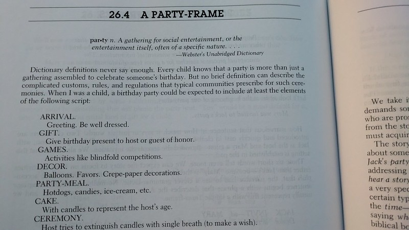

# Frame-Based Knowledge Representation Workshop



A modern Python implementation of frame-based knowledge representation inspired by MIT's FRL (Frame Representation Language) from the 1970s.

## Features

- **Frames**: Knowledge structures with slots and facets
- **Computed Values**: Lazy evaluation with `if_needed`
- **Active Values (Demons)**: Triggers on value changes
- **Prototype Inheritance**: Share knowledge between frames
- **Persistence**: Save/load frames as JSON
- **Cross-Platform**: Works on Linux, FreeBSD, macOS, and in containers

## Quick Start

```bash
# Clone the repository
git clone https://github.com/aygp-dr/frames-explorer.git
cd frames-explorer

# Set up development environment (optional)
make init

# Run interactive examples
python3 examples.py

# Or run tests
python3 test_frames.py
```

## Basic Usage

```python
from frame_system import fassert, fget, fput

# Create a frame
robot = fassert('my-robot',
    type={'value': 'service-robot'},
    height={'value': 1.5, 'units': 'meters'},
    battery={'value': 85, 'units': 'percent'}
)

# Access values
print(fget('my-robot', 'height'))  # 1.5
print(fget('my-robot', 'height', 'units'))  # meters

# Update values
fput('my-robot', 'battery', 75)
```

## Examples

Run the examples to see various features:

```python
python3 examples.py
# Then try: example_basic(), example_demons(), etc.
```

## Testing

Run the test suite:

```bash
python3 test_frames.py
```

## Platform Compatibility

Tested on:
- Linux x86_64 (Debian)
- Linux ARM64 (Raspberry Pi)
- FreeBSD 14.2-RELEASE (amd64)
- Alpine Linux (Docker)

## License

MIT License - Use freely!

## Reading List

This implementation is based on foundational work in frame-based knowledge representation:

- Marvin Minsky (1974): [A Framework for Representing Knowledge](https://dspace.mit.edu/handle/1721.1/6089). AIM-306, Cambridge, US: MIT.
- R. Bruce Roberts and Ira P. Goldstein (1977): [FRL Primer](https://dspace.mit.edu/handle/1721.1/5767). AIM-408, Cambridge, US: MIT.
- R. Bruce Roberts and Ira P. Goldstein (1977): [FRL Manual](https://dspace.mit.edu/handle/1721.1/5768). AIM-409, Cambridge, US: MIT.
- Marvin Minsky (1986): [The Society of Mind](https://en.wikipedia.org/wiki/Society_of_Mind). Simon & Schuster.

## Credits

Inspired by FRL (Frame Representation Language) from MIT AI Lab, 1970s.
Modern implementation by aygp-dr.
